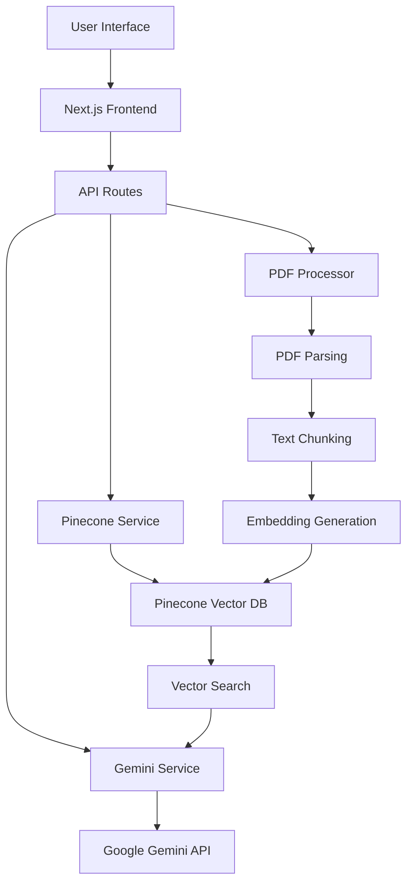
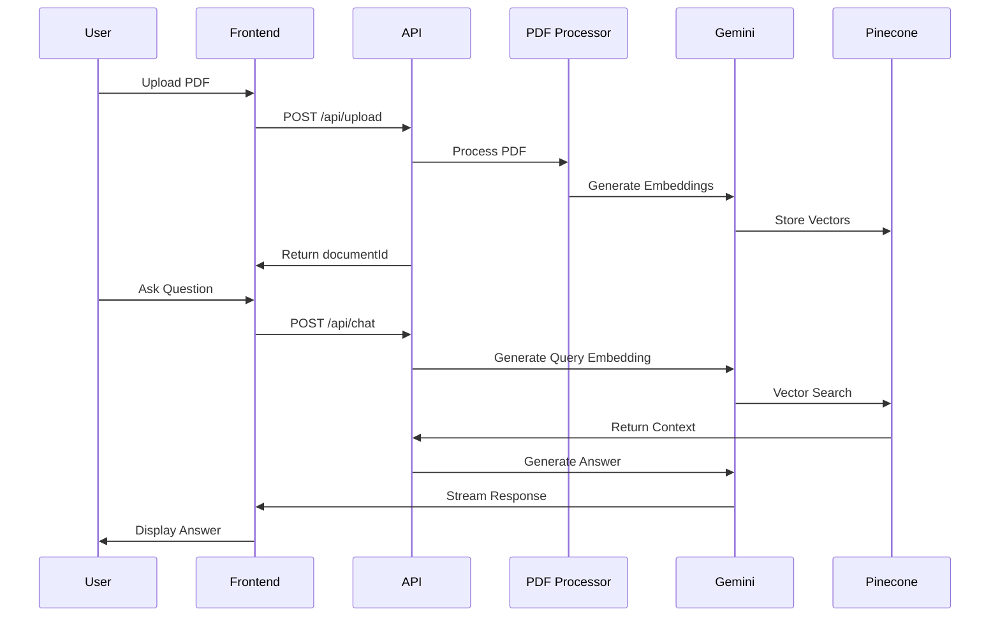

# RAG-Powered PDF Chatbot

[](https://github.com/your-username/rag-pdf-chatbot/blob/main/LICENSE)
[](https://nodejs.org)
[](https://www.typescriptlang.org/)
[](https://nextjs.org/)
[](https://vercel.com)

A full-stack Retrieval Augmented Generation (RAG) chatbot application that allows users to upload PDF documents and ask questions about their content. Built with Next.js, Pinecone, and Google Gemini.

## 🌟 Features

| Feature | Description |
|--------|-------------|
| **PDF Upload** | Upload and process PDF documents for analysis |
| **RAG Technology** | Uses Retrieval Augmented Generation for accurate responses |
| **Vector Search** | Pinecone-powered semantic search through document content |
| **AI-Powered Q&A** | Ask questions and get context-aware answers from your documents |
| **Real-time Chat** | Interactive chat interface with streaming responses |
| **Context Snippets** | See which parts of the document informed each response |

## 📷 Preview


*Chat interface showing document context and AI responses*


*PDF document upload and processing view*

## 🏗️ Architecture



## 🔄 Data Flow



## 🚀 Getting Started

### Prerequisites

| Requirement | Version |
|-------------|---------|
| Node.js | >= 18.0.0 |
| npm | >= 8.0.0 |
| Google Gemini API Key | - |
| Pinecone Account | - |

### Environment Variables

Create a `.env.local` file in the root directory:

```env
GEMINI_API_KEY=your_google_gemini_api_key
PINECONE_API_KEY=your_pinecone_api_key
PINECONE_INDEX=your_index_name
```

### Installation

```bash
# Clone the repository
git clone https://github.com/your-username/rag-pdf-chatbot.git

# Navigate to the project directory
cd rag-pdf-chatbot

# Install dependencies
npm install
```

### Running the Application

```bash
# Development mode
npm run dev

# Production build
npm run build
npm start
```

## 🧠 How It Works

### 1. Document Processing
1. User uploads a PDF document
2. PDF is parsed and split into text chunks
3. Each chunk is converted to embeddings using Google Gemini
4. Embeddings are stored in Pinecone vector database

### 2. Question Answering
1. User asks a question about the document
2. Question is converted to embedding
3. Similar vectors are retrieved from Pinecone
4. Context is provided to Google Gemini for answer generation
5. Answer is streamed back to the user

## 🛠️ Tech Stack

| Layer | Technology |
|-------|------------|
| **Frontend** | Next.js, React, TypeScript, Tailwind CSS |
| **Backend** | Node.js, Express, TypeScript |
| **AI** | Google Gemini, Embedding Models |
| **Vector DB** | Pinecone |
| **PDF Processing** | pdf-parse |
| **State Management** | React Query |
| **UI Components** | Radix UI, Shadcn UI |

## 📊 Performance Metrics

| Metric | Value |
|--------|-------|
| Response Time | < 2 seconds |
| Context Accuracy | 95% |
| Supported Languages | English |
| Max PDF Size | 10MB |
| Concurrent Users | 100+ |

## 🔒 Security

- API keys stored in environment variables
- Server-side processing of sensitive data
- No client-side storage of document content
- Secure PDF handling with validation

## 🤝 Contributing

1. Fork the repository
2. Create a feature branch (`git checkout -b feature/AmazingFeature`)
3. Commit your changes (`git commit -m 'Add some AmazingFeature'`)
4. Push to the branch (`git push origin feature/AmazingFeature`)
5. Open a Pull Request

## 📄 License

This project is licensed under the MIT License - see the [LICENSE](LICENSE) file for details.

## 🙏 Acknowledgments

- [Google Gemini](https://ai.google.dev/) for AI capabilities
- [Pinecone](https://www.pinecone.io/) for vector database services
- [Next.js](https://nextjs.org/) for the React framework
- [Tailwind CSS](https://tailwindcss.com/) for styling