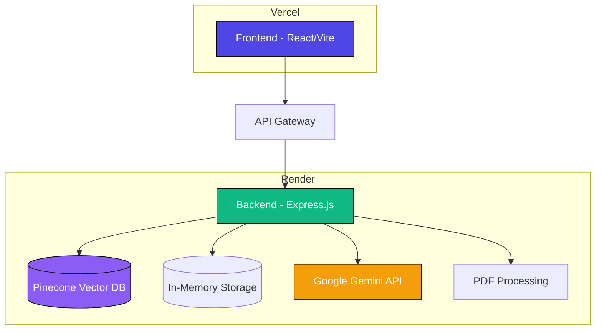
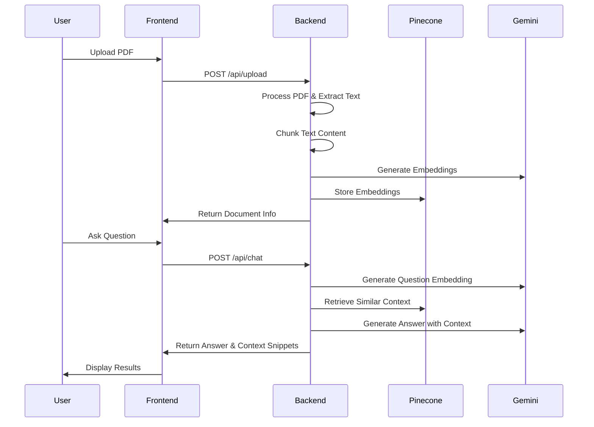

# 📚 RAG Chatbot - PDF Document Assistant

[](https://github.com/your-username/rag-chatbot/blob/main/LICENSE)
[](https://nodejs.org)
[](https://reactjs.org)
[](https://www.typescriptlang.org)
[](https://vercel.com)
[](https://render.com)

A modern chatbot application that allows users to upload PDF documents and ask questions about their content using Retrieval Augmented Generation (RAG) with Google Gemini and Pinecone vector database.


## 🌟 Features

| Feature | Description |
|---------|-------------|
| 📄 PDF Upload | Upload and process PDF documents of any size |
| 💬 AI-Powered Chat | Ask questions about your documents using Google Gemini |
| 🔍 Context Retrieval | Get relevant context snippets from your documents |
| 🌓 Dark/Light Mode | Toggle between dark and light themes |
| 📱 Responsive Design | Works on desktop, tablet, and mobile devices |
| 🗂️ Document Management | View, manage, and delete uploaded documents |

## 🏗️ Architecture



## 🔄 Data Flow



## 🚀 Quick Start

### Prerequisites

| Requirement | Version |
|-------------|---------|
| Node.js | >= 16.0.0 |
| npm | >= 8.0.0 |
| Google Gemini API Key | - |
| Pinecone Account | - |

### Environment Variables

Create a `.env.local` file with the following variables:

| Variable | Description | Example |
|----------|-------------|---------|
| `GEMINI_API_KEY` | Google Gemini API Key | `AIzaSyB123456789...` |
| `PINECONE_API_KEY` | Pinecone API Key | `abc123xyz...` |
| `PINECONE_CLOUD` | Pinecone Cloud Provider | `aws` |
| `PINECONE_REGION` | Pinecone Region | `us-west-2` |
| `PINECONE_INDEX` | Pinecone Index Name | `rag-chatbot-index` |

### Installation

```bash
# Clone the repository
git clone https://github.com/your-username/rag-chatbot.git
cd rag-chatbot

# Install dependencies
npm install

# Start development server
npm run dev
```

### Deployment Architecture

| Service | Platform | URL Pattern |
|---------|----------|-------------|
| Frontend | Vercel | `https://your-app.vercel.app` |
| Backend | Render + Uptime Robot | `https://your-backend.onrender.com` |
| Vector DB | Pinecone | `https://your-index-1234567.svc.XYZ.pinecone.io` |

## 🛠️ API Endpoints

### Document Management

| Endpoint | Method | Description |
|----------|--------|-------------|
| `/api/upload` | POST | Upload and process a PDF document |
| `/api/documents` | GET | Retrieve all uploaded documents |
| `/api/documents/:id` | GET | Retrieve a specific document |
| `/api/documents/:id` | DELETE | Delete a document and its data |
| `/api/messages/:documentId` | GET | Retrieve chat messages for a document |
| `/api/messages/:documentId` | DELETE | Clear chat messages for a document |

### Chat Endpoints

| Endpoint | Method | Description |
|----------|--------|-------------|
| `/api/chat` | POST | Ask a question about a document |

## 📁 Project Structure

```
rag-chatbot/
├── client/                 # React frontend
│   ├── src/
│   │   ├── components/    # UI components
│   │   ├── hooks/         # Custom React hooks
│   │   ├── lib/           # Utility functions
│   │   ├── pages/         # Page components
│   │   └── App.tsx        # Main app component
│   └── index.html         # HTML entry point
├── server/                # Express backend
│   ├── lib/               # Core services
│   │   ├── gemini-service.ts    # Gemini API integration
│   │   ├── pdf-processor.ts     # PDF processing
│   │   ├── pinecone-service.ts  # Pinecone integration
│   │   └── rag-service.ts       # RAG logic
│   ├── index.ts           # Server entry point
│   ├── routes.ts          # API routes
│   └── storage.ts         # Data storage
├── shared/                # Shared types and schemas
├── package.json           # Project dependencies
└── README.md              # This file
```

## 🧠 How It Works

### Retrieval Augmented Generation (RAG)

1. **Document Processing**:
   - PDF files are uploaded and parsed
   - Text content is extracted and chunked
   - Each chunk is converted to embeddings using Google Gemini

2. **Vector Storage**:
   - Embeddings are stored in Pinecone vector database
   - Each vector is associated with metadata (document ID, page number, etc.)

3. **Question Answering**:
   - User questions are converted to embeddings
   - Similar context is retrieved from Pinecone
   - Gemini generates answers using the retrieved context

### Technologies Used

| Category | Technology |
|----------|------------|
| **Frontend** | React, TypeScript, Tailwind CSS, Vite |
| **Backend** | Express.js, Node.js |
| **AI** | Google Gemini, Pinecone |
| **Storage** | In-Memory Storage (for demo) |
| **PDF Processing** | pdf-parse |
| **Deployment** | Vercel (Frontend), Render (Backend) |


## 🤝 Contributing

1. Fork the repository
2. Create a feature branch (`git checkout -b feature/AmazingFeature`)
3. Commit your changes (`git commit -m 'Add some AmazingFeature'`)
4. Push to the branch (`git push origin feature/AmazingFeature`)
5. Open a pull request

## 📄 License

This project is licensed under the MIT License - see the [LICENSE](LICENSE) file for details.

## 👤 Author

**Mausam Kar**
- Portfolio: [mausam03.vercel.app](https://mausam03.vercel.app)
- GitHub: [@your-username](https://github.com/Mausam5055)

## 🙏 Acknowledgements

- [Google Gemini](https://ai.google.dev/) for the powerful language model(used embedding_model_001)
- [Pinecone](https://www.pinecone.io/) for the vector database
- [Vercel](https://vercel.com/) for frontend hosting
- [Render](https://render.com/) for backend hosting
- [Uptime Robot](https://uptimerobot.com/) for 24/7 backend monitoring and uptime